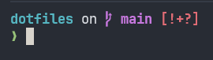
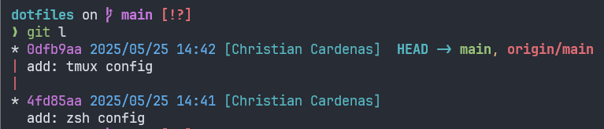

# My dotfiles

## Usage

Clone the repository

```bash
git clone https://github.com/nihilc/dotfiles
cd dotfiles
```

Copy or Link the config files to their respective location

```bash
cp ./config/zshrc ~/.zshrc
cp ./config/profile ~/.profile
cp ./config/starship.toml ~/.config/starship.toml
cp -r ./config/tmux ~/.config/tmux
cp -r ./config/git ~/.config/git
cp -r ./config/htop ~/.config/htop
```

```bash
ln -s "$(realpath ./config/zshrc)" ~/.zshrc
ln -s "$(realpath ./config/profile)" ~/.profile
ln -s "$(realpath ./config/starship.toml)" ~/.config/starship.toml
ln -s "$(realpath ./config/tmux)" ~/.config/tmux
ln -s "$(realpath ./config/git)" ~/.config/git
ln -s "$(realpath ./config/htop)" ~/.config/
```

For tmux you need to install [tpm](https://github.com/tpm/tpm)

```bash
git clone https://github.com/tmux-plugins/tpm.git ~/.config/tmux/plugins/tpm
```

Finally open tmux and install the plugins with `prefix` + `I` (capital i)

## Configs

### Zsh

Minimal config with starship and a few plugins and aliases



**Requirements**

- git
- fzf > 4.0
- starship

**Usage**

Copy or Link the configuration files

```bash
cp ./config/zshrc ~/.zshrc
cp ./config/profile ~/.profile
cp ./config/starship.toml ~/.config/starship.toml
#or
ln -s "$(realpath ./config/zshrc)" ~/.zshrc
ln -s "$(realpath ./config/profile)" ~/.profile
ln -s "$(realpath ./config/starship.toml)" ~/.config/starship.toml
```

### Tmux

It's a simple config the most important changes are the [bindings](./config/tmux/KEYMAPS.md), and I use my own [theme](https://github.com/nihilc/tmux.theme)


**Usage**

Copy or link the tmux folder

```bash
cp -r ./config/tmux ~/.config/tmux
# or
ln -s "$(realpath ./config/tmux)" ~/.config/tmux
```

Then install [tpm](https://github.com/tpm/tpm)

```bash
git clone https://github.com/tmux-plugins/tpm.git ~/.config/tmux/plugins/tpm
```

Finally open tmux and install the plugins with `prefix` + `I` (capital i)

### Git

Just some basic config, aliases and custom log



**Usage**

Copy or Link the configuration files

```bash
cp -r ./config/git ~/.config/git
#or
ln -s "$(realpath ./config/git)" ~/.config/git
```

### Others

- htop

**Usage**

Copy or Link the configuration files

```bash
cp -r ./config/htop ~/.config/htop
```

```bash
ln -s "$(realpath ./config/htop)" ~/.config/
```
